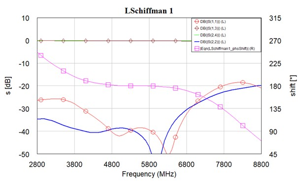
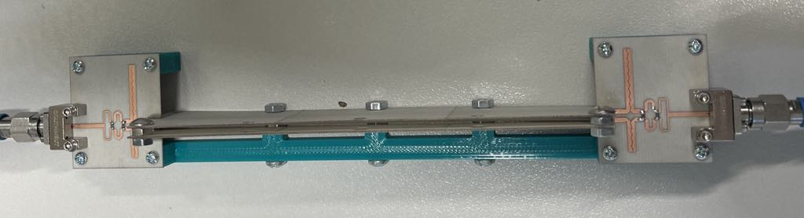

# Second_microwave_sensor - The full project report will be created after the initial tests are completed.
This is a project I am currently working on as part of my master's thesis. The sensor is designed to measure the electrical permittivity of objects passing through it, which allows, for example, the measurement of the moisture content of rapeseed grains — this will be its main application.

## Project Report
### Electronics and Telecommunications - Master's thesis
### Author: Damian Machnik
### Date: 8th June 2025

## Table of contents
1. [Project Description and Objectives](#project-description-and-objectives)
   
   1.1. [Project Goal](#project-goal)
   
   1.2. [Project Assumptions](#project-assumptions)

   1.3. [Symulation environment](#symulation-environment)
  
2. [Project results](#project-results)
   
   2.1. [Balun](#Balun)
   
   2.2. [Coupled lines](#Coupled-lines)

   2.3. [Fabricated device](#fabricated-device)
   
3. [What will be done](#What-will-be-done)

## Project description and objectives

### Project goal
Rapeseed moisture content is one of the key physicochemical parameters of the seeds, because of its importance for ensuring optimal conditions for seed storage, as well as for determining the time of harvesting.  Measurement techniques usually use a large sample of seeds (in the case of capacitance meters e.g., 100 g). Therefore, the obtained result is an average value representative for the tested sample, but does not give the range of moisture of single seeds in a given batch of material. The project is a prototype of a sensor and a method of measuring moisture content of individual rapeseeds. The system utilizes multiple measurements of a complex reflection coefficient that correspond to different positions and orientations of a seed under test along the sensor.

### Project assumptions
The sensor was fabricated on Rogers RO4003C laminate (εr = 3.38, tanδ = 0.003), with a substrate thickness of 0.51 mm and copper thickness of 17.5 μm, due to its stable dielectric parameters as a function of frequency and mechanical strength.
The active part of the sensor will consist of coupled lines arranged one above the other, into which a differential signal will be introduced.The differences between the returning signal and the reference signal will be analyzed, and based on them, information about the electrical permittivity (moisture content) of the rapeseed grain will be determined.
The sensor should be as broadband as possible and matched at a center frequency of 5.8 GHz.

### Symulation environment 
The Balun simulations were carried out using the AWR Cadence simulation software, while the simulations of the coupled lines were performed in HFSS due to the need for 3D analysis.

## Project results

### Balun 
The Balun design was implemented using a Wilkinson power divider and a Schiffman phase shifter. These structures were designed to have a sufficiently wide bandwidth around 5.8 GHz.

To achieve a wider bandwidth, a two-stage Wilkinson power divider had to be implemented:

To achieve a 180° phase shift between signals over a wide bandwidth, it was necessary to design a special Schiffman phase shifter structure based on the First and Second Phase Periods in a Coupled Line (the phase shift is marked in pink):

After connecting and designing the outputs, the entire structure is presented as follows:

### Coupled lines
The simulation investigated the impact of various parameters of two coupled lines, including:
- the width and length of the transmission lines,
- the line tapering,
- the length of the connection to the Balun,
- the ground plane cutout in the Balun,
- the spacing between the lines,
- as well as other minor parameters.

The final design and characteristics of the lines are presented as follows:
(will be added soon becouse of expired HFSS student license)

### Fabricated device
Both the Balun and the coupled lines were fabricated using laser printing, and after preliminary testing with a spectrum analyzer, they were connected together using soldered joints.
To avoid unwanted damage and destruction of soldered connections, a casing was created using a 3D printer.
The entire construction is presented as follows:

The sensor exhibits considerable losses, primarily due to radiation from the coupled lines. The S parameters of the senor is presented as follows: 

The results of measurements conducted with a glass and a metal sphere moving over the sensor are presented below:

It can be observed that the influence of objects moving between the coupled lines increases with their electrical permittivity. 

Moist grains exhibit higher electrical permittivity, which is reflected in the sensor response as shown above. In this way, the moisture content of the grain will be determined.

## What will be done
In the coming months, improved versions of the sensor will be designed and detailed studies will be conducted on rapeseed grains. A comprehensive report will then be prepared, and a summarized version of it will be published on GitHub. The above report is temporary
